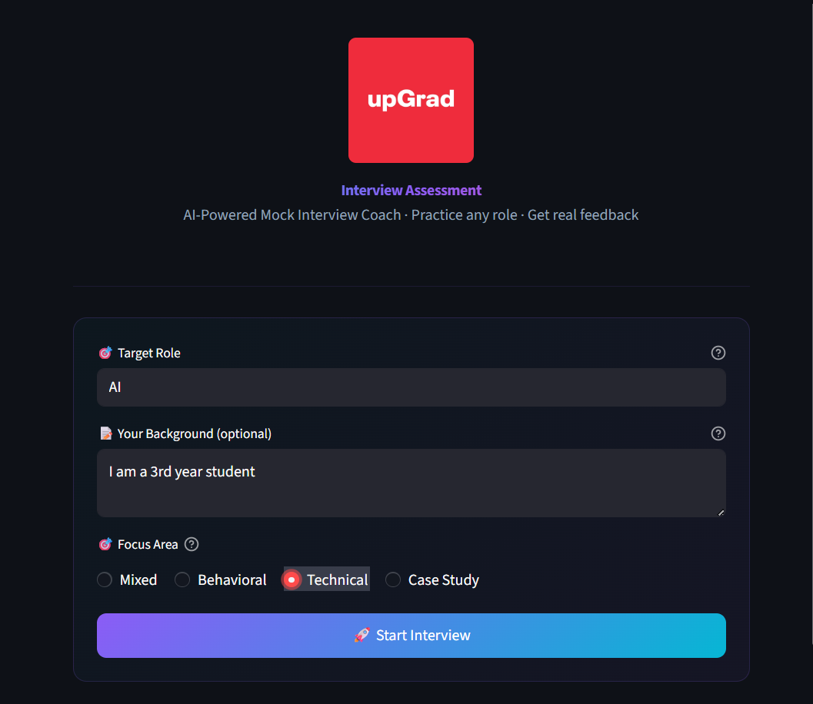
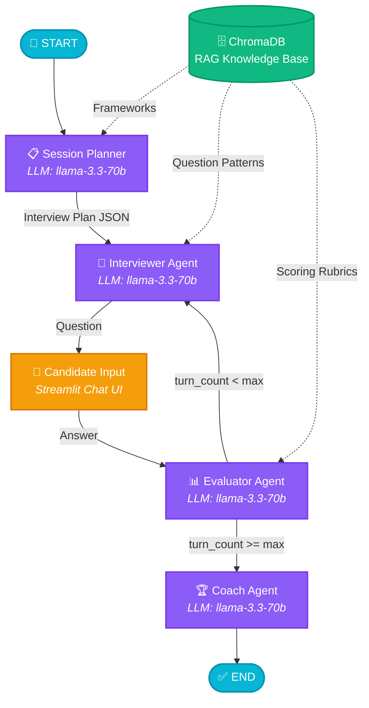
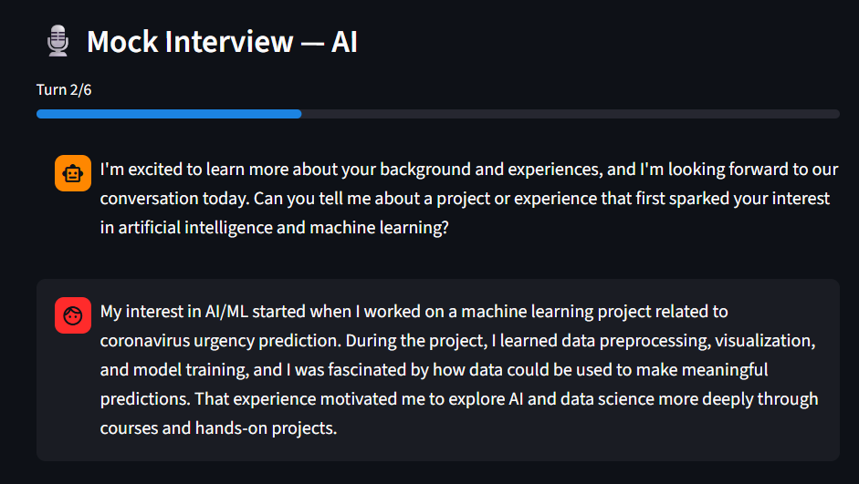
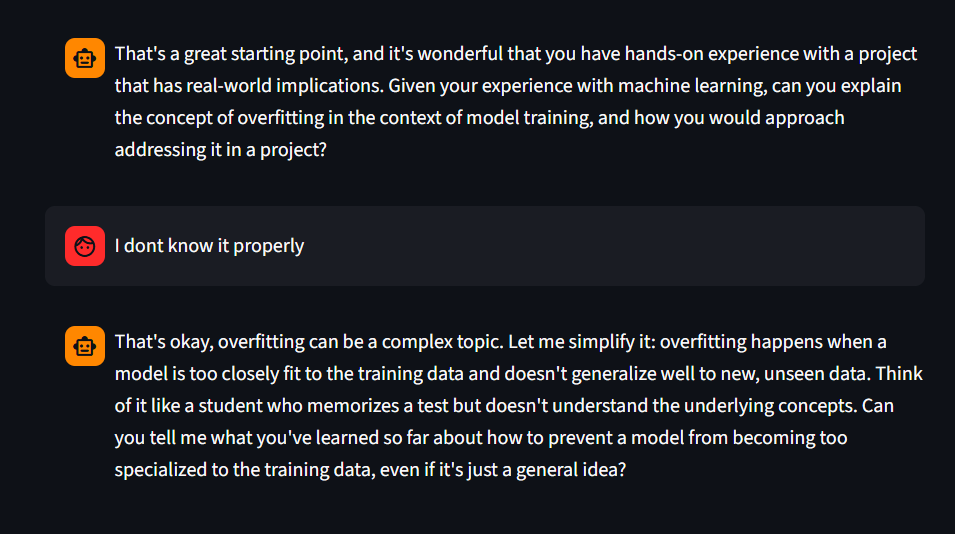

# 🎯 AI Mock Interview Coach

> **UpGrad Internship Assessment** — A role-agnostic, multi-agent AI system that conducts adaptive mock interviews for any job role using LangGraph, RAG, and LLMs.



---

## 📌 Overview

The AI Mock Interview Coach is a **dynamic multi-agent system** that simulates realistic job interviews for **any role** — from Software Engineer to Product Manager to HR Business Partner. It adapts question difficulty in real-time based on candidate performance and provides detailed feedback at the end.

### Key Features

- 🎭 **Role-Agnostic** — Type any job role; the system dynamically plans relevant interview topics
- 🤖 **4 Specialized AI Agents** — Planner, Interviewer, Evaluator, Coach (each with a dedicated prompt)
- 📚 **RAG-Powered** — Grounded in a curated knowledge base of interview frameworks, question patterns, and scoring rubrics
- 📊 **Real-Time Scoring** — Silent per-turn evaluation (1-5 scale) on Clarity, Depth, and Relevance
- 🔄 **Adaptive Difficulty** — Increases difficulty for strong answers, probes deeper for weak ones
- 🏆 **Detailed Feedback Report** — Strengths, improvement areas, and actionable practice tips

---

## 🏗️ Architecture

### Agent Workflow



### Agent Breakdown

| Agent | File | Model | Runs | Purpose |
|-------|------|-------|------|---------|
| **Session Planner** | `agents/planner.py` | `llama-3.3-70b-versatile` | Once at start | Takes any role → uses LLM world knowledge + RAG frameworks → outputs a JSON interview plan with topics, difficulty, categories |
| **Interviewer** | `agents/interviewer.py` | `llama-3.3-70b-versatile` | Every turn | Reads the plan + evaluator feedback → generates adaptive questions → adjusts difficulty dynamically |
| **Evaluator** | `agents/evaluator.py` | `llama-3.3-70b-versatile` | Every turn (silent) | Scores each answer on Clarity, Depth, Relevance (1-5) → sends recommendation to Interviewer (`probe_deeper` / `move_on` / `increase_difficulty`) |
| **Coach** | `agents/coach.py` | `llama-3.3-70b-versatile` | Once at end | Reads ALL evaluations + full chat → generates a comprehensive Markdown feedback report |

### How RAG Works

The system uses **Retrieval-Augmented Generation** to ground agent decisions in curated interview methodology:

| Step | What Happens |
|------|-------------|
| **Ingestion** (once) | 14 markdown files from `knowledge_base/` → chunked → embedded with `BAAI/bge-m3` → stored in ChromaDB (28 chunks) |
| **Retrieval** (per turn) | Each agent queries ChromaDB with metadata filters (`doc_type`, `category`) → gets top-3 most relevant chunks |

**Knowledge Base Structure:**

```
knowledge_base/
├── frameworks/           # STAR method, competency mapping, difficulty calibration
├── question_patterns/    # Universal templates for behavioral, technical, situational, case, leadership, culture-fit
└── rubrics/              # Scoring criteria with detailed 1-5 scale descriptions
```

---

## 🖥️ Demo Screenshots

### Intake Form — Role-Agnostic Setup
The system accepts any job role and adapts automatically.


### Strong Answer → System Acknowledges & Moves Forward
When the candidate gives a detailed, structured answer, the system recognizes quality and progresses.



### Weak Answer → System Adapts & Probes Deeper
When the candidate says *"I don't know it properly"*, the interviewer simplifies the concept and re-asks the question — demonstrating adaptive difficulty.



---

## 🔑 Key Design Decisions & Tradeoffs

### 1. LangGraph for Orchestration
- **Why**: Provides typed state management (`AgentState`), conditional routing, and a clear graph-based flow — perfect for a multi-agent loop
- **Tradeoff**: The interview loop (Interviewer → User → Evaluator) is managed by Streamlit's `session_state` rather than LangGraph's built-in interrupt, since Streamlit handles the user input cycle natively

### 2. RAG with Universal Knowledge Base (Not Role-Specific)
- **Why**: Instead of storing thousands of role-specific question banks, the knowledge base contains **universal interview patterns** (STAR framework, behavioral templates, scoring rubrics). The LLM's world knowledge adapts these patterns to any role
- **Tradeoff**: Less granular role-specific context, but infinite scalability to any job role without adding new documents

### 3. Silent Evaluator Pattern
- **Why**: The Evaluator runs after every answer but never shows output to the user — it only writes to `state["evaluations"]`. This keeps the interview natural while still scoring every turn
- **Tradeoff**: The evaluator's feedback loop (recommendation → interviewer) creates a 2-LLM-call overhead per turn

### 4. Embedding Model Choice (BAAI/bge-m3)
- **Why**: High-quality multilingual embeddings with 1024 dimensions, strong performance on retrieval benchmarks
- **Tradeoff**: 2.27GB model size — larger than lightweight alternatives like `all-MiniLM-L6-v2`, but significantly better retrieval quality

### 5. Single LLM Provider (Groq + Llama 3.3 70B)
- **Why**: Groq provides extremely fast inference (~500 tokens/sec) for free, making the interview feel real-time. 70B model ensures high reasoning quality for all agents
- **Tradeoff**: Free tier has rate limits; production deployment would need a paid plan or multi-provider fallback

---

## 📂 Project Structure

```
ai_interview_coach/
├── main.py                  # Streamlit UI (3 phases: intake → chat → feedback)
├── graph.py                 # LangGraph state machine & agent wiring
├── graph.mmd                # Mermaid workflow diagram (for docs)
├── requirements.txt         # Python dependencies
├── logo.jpg                 # UpGrad logo
├── .env                     # API keys (not committed)
│
├── agents/                  # 4 AI agent nodes
│   ├── planner.py           # Session Planner (runs once)
│   ├── interviewer.py       # Interviewer (runs every turn)
│   ├── evaluator.py         # Evaluator (silent, every turn)
│   └── coach.py             # Coach (runs at end)
│
├── prompts/                 # System prompts for each agent
│   ├── planner_prompt.py
│   ├── interviewer_prompt.py
│   ├── evaluator_prompt.py
│   └── coach_prompt.py
│
├── rag/                     # RAG pipeline
│   ├── ingest.py            # One-time ingestion script
│   └── retriever.py         # Retrieval functions (get_frameworks, get_question_patterns, get_rubric)
│
├── knowledge_base/          # Source documents for RAG
│   ├── frameworks/          # STAR method, competency mapping, difficulty calibration
│   ├── question_patterns/   # Universal question templates (6 categories)
│   └── rubrics/             # Scoring criteria (5 rubric files)
│
├── screenshots/             # Demo screenshots for README
└── chroma_db/               # ChromaDB vector store (generated, not committed)
```

---

## 🚀 Setup & Run

### Prerequisites
- Python 3.11+
- [Groq API Key](https://console.groq.com/keys) (free)

### Step 1: Clone & Install

```bash
git clone https://github.com/Yashraj0906/ai_mock_interview_coach.git
cd ai_mock_interview_coach

python -m venv venv
# Windows
venv\Scripts\activate
# macOS/Linux
source venv/bin/activate

pip install -r requirements.txt
```

### Step 2: Configure API Key

Create a `.env` file in the project root:
```
GROQ_API_KEY=gsk_your_actual_key_here
```

### Step 3: Run RAG Ingestion (One Time Only)

```bash
python -m rag.ingest
```

This processes the knowledge base into ChromaDB. Only needs to run **once** — subsequent runs will skip automatically.

To force re-ingestion (e.g., after updating knowledge base files):
```bash
python -m rag.ingest --force
```

### Step 4: Launch the App

```bash
streamlit run main.py
```

Opens at [http://localhost:8501](http://localhost:8501)

---

## 🛠️ Tech Stack

| Component | Technology |
|-----------|-----------|
| **Orchestration** | LangGraph (state machine with conditional routing) |
| **LLM** | Llama 3.3 70B via Groq API |
| **Embeddings** | BAAI/bge-m3 (sentence-transformers) |
| **Vector Store** | ChromaDB (persistent, local) |
| **Framework** | LangChain + LangGraph |
| **UI** | Streamlit |
| **Structured Output** | Pydantic v2 |


